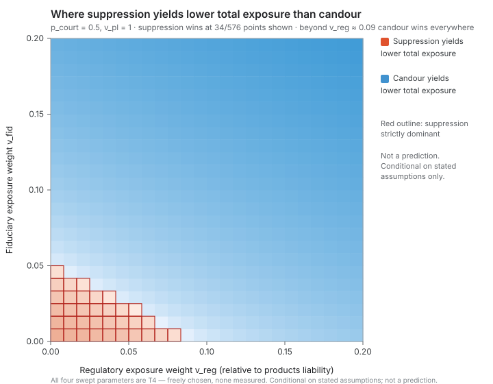

# DocFlow v0.3 — what the model found, and what it cannot support

**Version 0.3.0 · 2026-08-18 · 501 automated checks**

DocFlow is a system-dynamics model of how an AI firm's incident-documentation behaviour
settles into one of two self-reinforcing regimes: a **chilling** equilibrium where the
rational move is not to write things down, and a **learning** equilibrium where candour
compounds. v0.3 rebuilt it as a research instrument rather than a teaching aid.

This document is the short version for someone who has not read the code. It states the
one substantive result, the four findings that came out of building it, and — at more
length than is comfortable — what the model is not entitled to claim.

---

## 1. Read this before any number below

**Nothing in this model is measured.** Of 101 registered parameters:

| Tier | Meaning | Count |
|---|---|---|
| T1 | Measured in the AI-firm domain | **0** |
| T2 | Estimated from an analogous domain | **0** |
| T3 | Structural — a definition, not a claim | 14 |
| T4 | Freely chosen, with stated bounds | 87 |

That census is asserted by a test; promoting anything toward "measured" fails CI until the
expected census is edited in the same commit, which forces the promotion to be argued in a
diff rather than slipped in.

So: **no output of this model is a prediction, and no number in it is evidence about the
world.** What the model can do is tell you which *conclusions follow from which
assumptions*, and locate the boundaries between them. Every figure below should be read as
"under these stated assumptions", never as "in reality".

The privilege coefficients specifically are uncalibrated by decision, not by oversight.
`CALIBRATION.md` §3 specifies a case-law coding protocol — factor rubric, double coding,
Cohen's κ, adjudication — and it **has not been executed**. Nothing here is legal advice
and nothing here predicts a ruling.

### A note on the word "measured"

This document uses it in two senses and a reader is entitled to be annoyed by that, so
they are separated here once.

- **Measured against the world** — an empirical observation of a real AI firm. The
  provenance table's T1 tier means this, and the count is **zero**.
- **Measured from the model** — a number obtained by running the code, as in "measured
  π = 0.989" or "the threshold moves from 0.084 to 0.085". These are computations, and
  they are reported as measurements only in the sense that they were obtained by running
  something rather than asserted.

Every figure in this document is the second kind. None is the first. Where the
distinction could be missed the text says "computed" instead.

---

## 2. The result: where suppression pays, and what it costs

The paper's central worry is that a firm facing products-liability discovery may find
silence cheaper than candour. v0.3 can represent both outcomes, which is the precondition
for the question being worth asking. Two architectures were run through the same legal
environment:

- **candid** — a pre-committed protected workflow with a preserved factual record and high
  just-culture (PSQIA-shaped; computed privilege survival π = 0.989)
- **suppressive** — post-hoc counsel engagement, oral-only analysis, minimal scaffolding
  (the cybersecurity anti-pattern; π = 0.065)

The environment was swept over the four things no firm controls and nobody has measured:
`p_court` (would a court credit a pre-committed telemetry tripwire), and the relative
weights of products-liability, regulatory and fiduciary exposure. 216 environment points.

**Suppression yields lower total exposure at 6 of 216 points — 2.8%.**

That region is not scattered. It is exactly the corner where **both regulatory and
fiduciary exposure carry zero weight**: a world with no enforcement and no oversight
liability. Products-liability exposure alone does not make silence pay.

Three things follow, and the third is the one worth arguing about.

**The threshold is low.** With fiduciary exposure at zero, regulatory exposure needs only
**8.4%** of the weight of products-liability exposure before candour becomes the
lower-exposure choice. Once fiduciary exposure carries its default weight, candour wins
across the entire regulatory range and there is no threshold to report.

**The paper's own central caveat turns out not to matter.** The paper concedes no court has
ruled on its central device. If the conclusion depended on `p_court`, that concession would
be fatal to it. Measured: the threshold moves from **0.084 to 0.085** across the whole
range of `p_court`. The comparison is essentially insensitive to the untested device — and
this is not because `p_court` is disconnected, which is separately checked: it does move
privilege and exposure, it just does not move *which architecture wins*.

**Where suppression wins, it wins badly.** At the single best point for suppression it
saves **6.1%** of total exposure and destroys **99.2%** of organisational learning
(`L = 0.4` against 46.8). An exposure-minimising firm in a no-enforcement world would
choose silence, and would end the period knowing almost nothing about its own failures.

*Figure 1 — the (v_reg, v_fid) plane at p_court = 0.5. Red-outlined cells are where
suppression yields lower total exposure. Axes are truncated at 0.2: over the full swept
range [0,3]² exactly one cell in 576 favours suppression, which is true and unreadable.
`docs/figures/boundary-full-range.svg` shows it. Regenerate with `npm run figures`.*

### What would overturn this

The result is a conditional and it is falsifiable. It would break if the three exposure
weights turned out to sit in that corner — if regulatory enforcement were effectively
absent *and* `Caremark`-style oversight liability were doctrinally dead. `v_fid` is
explicitly permitted to be zero for exactly that reason. It would also break if the
suppressive architecture's exposure were being overstated, which depends on `c_rec_exp`
and `c_harm_exp` — both T3 definitions of the exposure index rather than measurements.

---

## 3. Four findings from building it

The audit that opened v0.3 found eighteen defects in v0.2. Fourteen are now closed with
tests that would fail if they regressed. The more interesting findings are the ones that
came out of the repair work itself, against v0.3.

### F19 — a feedback loop that exists and does nothing

v0.2's headline defect (F1) was that the advertised chilling loop was not in the code:
`dC/dt` depended only on culture and parameters, so the debt → harm → exposure → culture
loop described in the documentation did not exist. v0.3 closed it, and the gate checks the
Jacobian's culture row is no longer zero. That gate passes.

Measuring the loop's **influence** rather than its presence tells a different story.
Scaling exposure and harm chill by **ten** changes final culture by **exactly zero** in
five of eight presets, and by ~1e-6 in the rest. The cause is saturation: the raw culture
target sits at 3.1–3.6 against a valid range of [0,1]. The chill terms respond correctly
and the clamp discards the response.

The wiring is sound — push to ~35× and the aviation regime does leave the learning
attractor. So the mechanism is real, reachable, and about 35× away from every operating
point the model ships with.

**Not fixed, deliberately.** The fix is rescaling coefficients until a loop becomes
visible, which is setting a free parameter to produce a qualitative behaviour. A lint
forbids exactly that. It is gated by a test that *asserts the defect*: if the loop becomes
live at a shipped preset, the test fails, and that failure is good news.

Read the other way it is a result: **the learning equilibrium in these five regimes is
robust to exposure chill up to roughly 35× the assumed coefficient, and tips beyond it.**

### F20 — two institutions the model cannot tell apart

The acceptance criterion asked every pair of the eight institutional presets to differ by
more than 5% of range on at least one output. **Aviation and nuclear separate by 4.27%.**
They differ by 0.00% on documentation fraction, culture and regulatory exposure, and by
≤1.7% on every state variable — while their input postures differ by 26% on factual-record
discoverability. The dynamics wash the difference out.

A fix was available and rejected. Counting the parameter-derived readouts as outputs lifts
the worst pair to 13.85% and the criterion passes — but those are functions of the levers
alone, so presets with different levers differ on them by construction. That would be
passing an interior-resolution test on a definitional choice. The 4.27% figure is ratcheted
instead, so it cannot quietly degrade.

The honest reading: DocFlow distinguishes the aviation and nuclear architectures only
through a 4.27% difference in accumulated learning. What would fix it is a detection stage
— those two regimes differ mainly in *what they can detect and how the signal travels*, and
the model has no detection stage, so the dimension on which they most differ is absent from
the state vector.

### F21 — a claim of mine that measurement did not support

A commit described the channel-disaggregation of discoverability as delivering an
"identifiability gain". Running the rank analysis afterwards measured what it delivered:
**rank 3 of 8** for those weights. Real improvement — under the previous lumped scalar all
eight fed one sum and were unidentifiable by construction — and not separability.

Building the analysis also exposed two live defects of the F1 class. Five registered
parameters sat at **singular value zero exactly**: they had been given a home in the
equations and wired to nothing. And Channel Three generated **no exposure at all**, making
remediation consequence-free — while the design record argues its shield should be *weak*,
because Rule 407 limits admissibility at trial and does nothing about discovery. Both are
now wired, which is what moved the rank from 1 to 3.

At the lever level the model is **rank 10 of 15** at contested presets, 8 of 15 at the
learning ones. The deficient directions are named rather than summarised, because a rank
number is not actionable. Two examples worth flagging: `precommit` and
`significant_purpose` trade off almost exactly, and `kovel_evaluator` is its own null
direction — it moves no reported output measurably. Both are privilege levers, so the
doctrinal fidelity added in v0.3 was bought at a real cost in identifiability.

### The structure added in v0.3 did not cost identifiability

The roadmap carried a gate written to be used: *if v0.3 turns out less identifiable than
v0.2 on shared outputs, cut stocks.* It went unevaluated for weeks because the comparison
needs the old engine. It has now been run — v0.2 extracted from its last commit, the same
analysis applied to both, over the **eleven levers present in both versions**:

| preset | v0.2 rank | v0.3 rank | deficient directions |
|---|---|---|---|
| contested | 7 / 11 | **10 / 11** | 4 → 1 |
| cybersecurity | 7 / 11 | **10 / 11** | 4 → 1 |
| aviation | 5 / 11 | **8 / 11** | 6 → 3 |

**The gate does not fire.** No stocks are cut.

The less flattering half, which belongs in the same breath: the condition number rose
everywhere, by two orders of magnitude at the contested baseline. Some of that is
mechanical — resolving more directions means retaining smaller singular values — but the
practical reading stands. v0.3 distinguishes more parameter directions, and the newly
distinguished ones are weakly informative.

One pair defeats both versions at every preset: `intermediary_capacity` and
`translation_layer` are not separable by these outputs. That is a durable property of the
model rather than something v0.3 introduced.

### F3 — the one that stays open, and cannot be closed here

Zero parameters are empirically anchored, and adding structure did not change that. v0.3
added four state variables and 39 parameters; the T1 and T2 counts are still zero. More
structure bought more expressiveness and no more evidence.

This is the binding constraint on the whole instrument, and it is the reason the roadmap's
remaining milestones were **not** built. The dominant risk recorded at the outset was
over-engineering a model whose empirical base cannot support the added structure, and the
rank numbers above say that point has been reached: the model already has more parameters
than its outputs can separate.

---

## 4. What the model supports, and what it does not

**It can support:**

- Conditional claims of the form "this architecture minimises total exposure provided
  ⟨stated conditions on the exposure weights⟩", with the boundary located and the
  sensitivity to each assumption reported.
- Comparative statements about the *direction* of a mechanism — that leakage costs twice,
  that a pre-committed channel survives where a post-hoc one does not, that a duty to
  document without analytic protection reproduces the chilling equilibrium.
- Statements about **robustness**: how far an assumption can move before a conclusion
  flips. The 35× chill result and the `p_court` insensitivity are both of this kind, and
  they are the model's most defensible outputs.

**It cannot support:**

- Any point prediction, any probability of a legal outcome, any statement about a real
  firm.
- Claims resting on the *magnitude* of a coefficient, since none is measured. Exposure
  numbers are comparable across runs and meaningless in absolute terms.
- Claims about individual levers inside a named deficient direction — `precommit` and
  `significant_purpose` cannot be separated by these outputs, so a claim about either one
  alone is not supported even though a claim about their combination is.
- Anything about exposure feeding back into documentation culture at a shipped operating
  point. The structure is present; the behaviour is not observable there (F19).
- Distinguishing the aviation and nuclear architectures on any dynamic outcome (F20).

---

## 5. How to check any of this

Every figure in this document is produced by a test, not typed in by hand.

| Claim | Where it is checked |
|---|---|
| Boundary result, threshold, `p_court` insensitivity | `src/engine/boundary.test.ts` |
| Rank, named deficient directions | `src/engine/identifiability.test.ts` |
| F19 — loop inert, tipping at ~35× | `src/engine/cultureLoopInfluence.test.ts` |
| F20 — 4.27% worst pair | `src/engine/identifiability.test.ts` |
| Provenance census, T1 = 0 | `src/engine/provenance.test.ts` |
| No parameter claims it was tuned to an outcome | `src/engine/tuningLanguage.test.ts` |
| Dimensional consistency, with written waivers | `src/engine/dimensional.test.ts` |
| Version contract — maths and version cannot drift | `src/engine/versionContract.test.ts` |
| The audit table agrees with the code | `src/engine/auditCurrency.test.ts` |
| M3 decision gate — v0.2 vs v0.3 identifiability | `src/engine/identifiabilityBaseline.test.ts` |
| The boundary figure matches the model | `src/engine/boundaryFigure.test.ts` |
| Firth estimator, incl. behaviour under separation | `src/engine/calibration/firth.test.ts` |
| The calibration gate refuses ungated promotion | `src/engine/calibration/coding.test.ts` |
| Every externally-cited parameter reaches the worklist | `src/engine/pinCite.test.ts` |

Run `npm run coverage` for all of them. The numbers printed to the console are the numbers
in this document.

The full internal record is in `docs/plan/`: `AUDIT.md` (every finding and its status),
`MODEL_v3_SPEC.md` (equations and provenance), `CALIBRATION.md` (what evidence would
constrain what, and the unexecuted coding protocol), `EPISTEMICS.md`, `VALIDATION.md`,
`RISKS.md`, `OPEN_QUESTIONS.md`, and twelve decision records including the ones recording
what was **rejected** and why.

---

## 6. What is ready for the evidence that does not exist yet

The binding constraint on this instrument is that nothing is measured against the world,
and no amount of further modelling changes that. Two things were built to make the next
step cheap rather than to postpone it.

**The case-law coding harness** (`src/engine/calibration/`). `CALIBRATION.md` §3 specifies
a protocol for coding privilege decisions on four factors — the only route this project has
off T1 = T2 = 0. The protocol needs a legal researcher; everything else is now built:

- a typed schema, and a seed file of the five decisions the paper relies on, **deliberately
  uncoded** — every factor is `null` rather than `0`, so an unread case can never be fitted
  as though it scored zero on everything;
- **Firth penalised logistic regression**, because §3.4 predicts separation at N ≈ 20 and
  ordinary maximum likelihood diverges there. Tested against known coefficients and against
  a perfectly separated design, where it returns a finite estimate and flags that the
  magnitude is the penalty talking rather than the data;
- Cohen's κ per factor, unweighted — the strict version, since a weighted κ would report a
  comfortable number for the same disagreement;
- a **promotion gate that refuses**. Fewer than ten cases, one coder, any factor below
  κ = 0.6, or detected separation, and the coefficients stay T4. `applyCalibration` throws
  rather than writing ungated numbers into a parameter set;
- and a path that **recomputes the boundary result** under calibrated coefficients, so the
  question "does the headline survive contact with evidence" is answered automatically
  rather than becoming a further project.

The ceiling is **T2**, not T1, however clean the coding gets. Decided breach-forensics case
law is an analog for AI incident forensics, not a measurement of it.

**The pin-cite worklist** (`docs/plan/PIN_CITE_WORKLIST.md`, generated). Every parameter
resting on external legal authority, what it asserts, and what to check. Building it found
that twelve parameters citing live authority — *Caremark*, AI Act Art. 73, PLD Art. 9(1),
*Kovel*, FRCP 26(b)(1), FRE 407 — carried no verification flag at all and would never have
reached anyone's list. The count went from 15 to 27.

## 7. Known gaps, stated rather than discovered

- **No detection stage.** The model assumes every incident is known. That deletes the
  argument about semantically silent failures entirely, and it is why F20 stands.
- **Hysteresis is ramping, not continuation.** The guard now refuses to report hysteresis
  when the ramp has not relaxed, which is honest, but true numerical continuation is not
  built.
- **Registered coefficients are outside the swept space.** The ~58 readout and tabletop
  weights are named and tiered but not varied in sensitivity analysis.
- **Tabletop scenario deltas were mechanically remapped** when privilege became endogenous.
  They are directionally right and not individually authored.
- **The v0.2 identifiability baseline was never computed**, so the decision gate that would
  have said "cut stocks if v0.3 is less identifiable" could not be evaluated as written.
  The comparable proxy — lever pairs above |r| > 0.999 — improved from 7/36 to 3/42.
- **One tabletop test remains structurally circular** ("no dominant path" is guaranteed by
  construction rather than demonstrated).

---

*DocFlow is decision-support and structured reasoning, not a forecast and not legal advice.
Built for the Arcadia Impact AI Governance Taskforce alongside "Architecting Candor:
Products Liability and AI Incident Knowledge Governance". It is an independent instrument:
where it contradicts the paper, the contradiction is the finding.*
